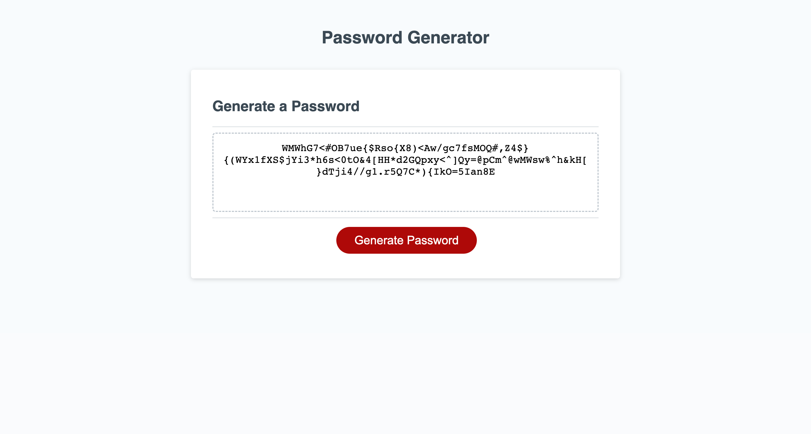

# Random-Password-Generator
# Description
For this assignment, we were asked to set up a functional random password generator, having already been given the necessary HTML and CSS, along with a few lines of JavaScript to establish button and password display functionality. To accomplish this task, I presented the user with several prompts and confirm messages to 1) receive the number of characters in their password, 2) confirm that their answer met the criteria for a valid password length, 3) ask them what kinds of characters they'd like included, and 3) check that they'd selected at least one character type before moving forward. From there, I created an array that stores all the potential characters from which the password could be randomly generated. I then created an empty string for the eventual password, which is populated via a for loop. Each iteration of the foor loop adds a randomly generated element from the array of possible characters into the password string, repeating until the requested number of characters has been generated. The result is then returned and displayed on the webpage.
# Live Link
https://zestnachow.github.io/Random-Password-Generator/
# Screenshot

